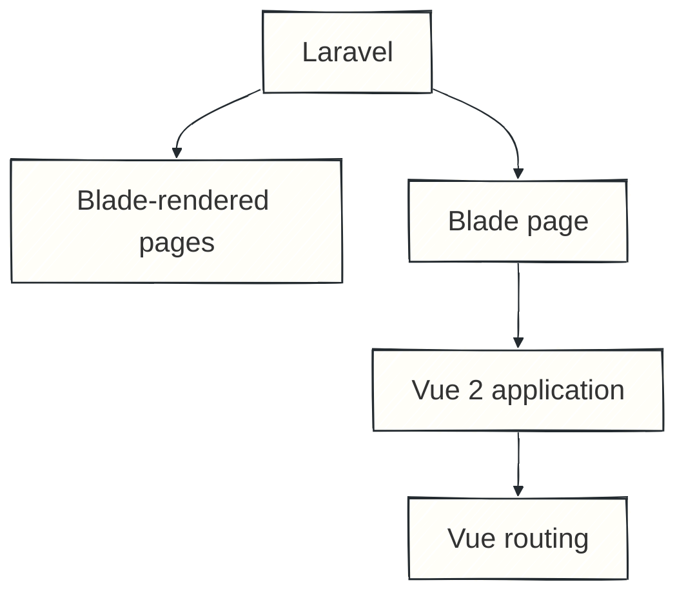
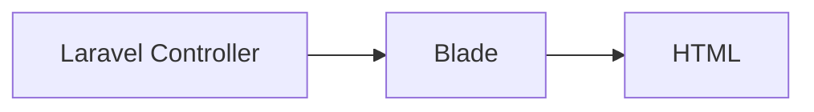
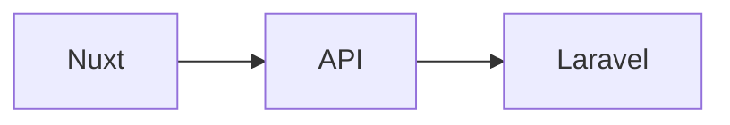
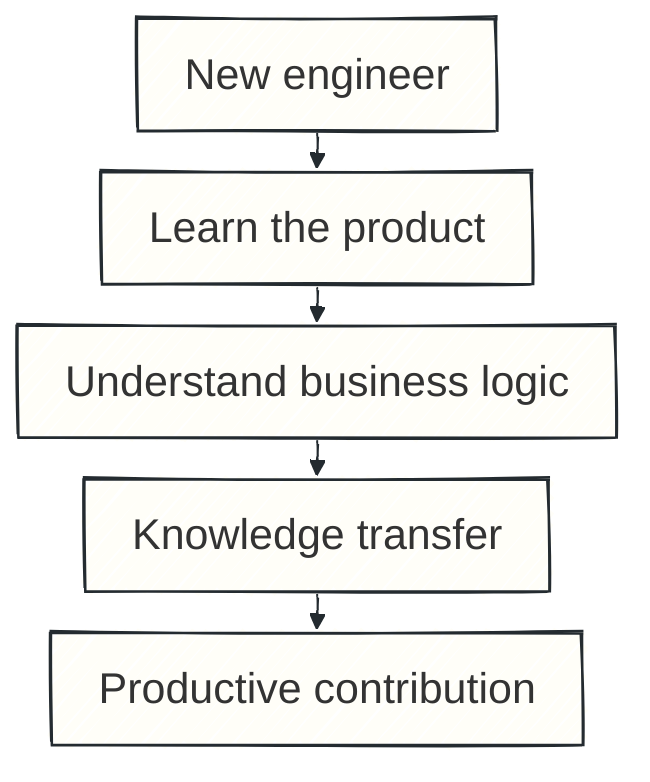
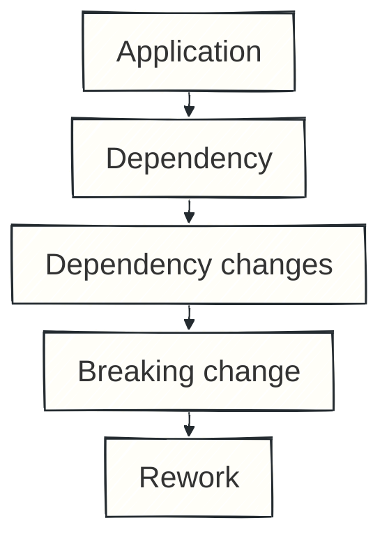

A real-world rewrite

# The Not So Straight Story

### A story about rewriting an app from scratch

  Andreas Panopoulos · Staff Engineer @ HackTheBox

<!--
Hello everyone.

My name is Andreas, and I'm a Staff Engineer at HackTheBox.

Today, I want to share a story about rewriting an entire application. We moved from a hybrid Laravel Blade and Vue 2 application to a new frontend built with Nuxt.

But this is not going to be only a talk about Vue, Nuxt, or changing frameworks. I want to talk about why we decided to rewrite the application, how we approached it, what didn't go as expected, why our original estimate wasn't enough, and, most importantly, what I would do differently if I had to do it again.
-->

---
layout: center
class: profile-slide
doodles: true
---

  

    
  

  

    
Hello, I'm

    
Andreas

    
Staff Engineer @HackTheBox

  

  Photography
  Music

<!--
Before we get into the technical story, a very quick introduction.

I'm Andreas. I work as a Staff Engineer at HackTheBox.

Outside engineering, I like photography, music, and cycling.

That is all you need to know about me for today. Let's start with the application we already had, because understanding where we started is important to understanding why this became much more than a framework upgrade.
-->

---
layout: two-cols
layoutClass: gap-12
---

# Where we started

## Two frontend worlds inside the same product.

::right::

<BoulitPaper>

</BoulitPaper>

<!--
Let's start with the application we already had.

It was a Laravel application, but I would describe it as a hybrid application. Some pages were completely rendered using Laravel Blade. Other parts of the platform were built with Vue 2.

For those parts, Laravel would first render a Blade page. That Blade page would initialise Vue, and from that point onwards, routing for that section of the application was handled by Vue.

So, essentially, we had two different worlds living inside the same product. We had pages where Laravel was responsible for rendering everything, and we had other sections where Laravel would give control to Vue.

I want to make something clear here: this architecture was not necessarily a bad decision. At that point in the life of the product, it helped us move forward and scale the platform.

Architecture decisions usually make sense in the context in which they were made. The problem is that applications change, teams change, companies grow, and requirements change. Eventually, our needs started to become different.
-->

---
layout: center
---

# Why change?

  
Vue 2 <strong>end of life</strong>

  
Frontend / backend <strong>separation</strong>

  
Consistent frontend <strong>architecture</strong>

  
Component <strong>reuse</strong>

  
Growing <strong>complexity</strong>

<!--
As the platform became bigger, and as we had more applications, consistency became much more important.

We wanted developers to be able to reuse common components and avoid rebuilding similar functionality again and again. We also wanted the frontend architecture itself to become more consistent.

At the same time, there was another important factor: Vue 2 was reaching its end of life. Migrating to Vue 3 was no longer simply something that would be nice to do in the future. It was becoming something we actually needed to address.

We also wanted to separate the frontend more clearly from the backend.

When we considered all of these pressures together, we realised that what we needed wasn't simply a small migration from Vue 2 to Vue 3. We were looking at a much bigger architectural change.

That was the point where we started talking about rewriting the frontend application.
-->

---
layout: center
class: text-center
---

  Nuxt
  Vue 3
  TypeScript
  Pinia

# The technology choice was the easy part.

<!--
Once we had decided to rewrite, we had to decide what the new application would look like.

One thing that was very important to us was having an opinionated structure. We wanted someone joining the team to understand quite quickly where things belong: where pages go, where components go, and where shared logic goes. We didn't want every developer to make those decisions again and again.

That was one reason we started looking at Nuxt. Nuxt gave us that structure. We also liked the ecosystem around it. There were existing modules and solutions that we could use instead of solving everything ourselves.

So we chose Nuxt. At the same time, we moved from JavaScript to TypeScript. The previous application contained JavaScript, Vue 2, and also some jQuery. For the new application, we wanted typing to give us an additional level of safety and make the data we were working with clearer.

For state management, we moved from Vuex to Pinia. We followed the direction of the Vue ecosystem, and we liked how Pinia let us organise state into smaller, focused stores.

Our new frontend was becoming Nuxt, Vue 3, TypeScript, and Pinia. But choosing that stack was actually the easy part.
-->

---
layout: center
---

# It wasn't just a Vue migration

  

    
Before

  

  

    
After

  

The frontend rewrite also created backend work.

<!--
There was something very important about this rewrite that affected the scope significantly.

Remember those Blade pages. Many pages in the old application were rendered directly by Laravel. A Laravel controller could prepare the data and render it directly into the Blade template. There didn't need to be an API endpoint for everything.

Once that page was going to live inside the Nuxt application, that changed. The frontend now needed a way to request the data.

For a number of pages, the backend also had work to do. Endpoints had to be created so that the new frontend could get the information it needed.

So when we talked about rewriting the application, this was not simply: take a Vue 2 component and rewrite it in Vue 3.

We were also taking pages that had previously been rendered by Laravel and turning them into frontend pages. For those pages, backend support had to be created as well.

This was one of the reasons the project was large. What sounded like a frontend rewrite crossed the frontend-backend boundary.
-->

---
layout: center
class: text-center
---

The original plan

  
<strong>2</strong>frontend engineers

  
×

  
<strong>≈ 1</strong>year

  Build the new app
  ·
  Support the existing app
  ·
  Limit new legacy scope

<!--
Eventually came the question that always comes: how long is this going to take?

At that time, we had two frontend engineers working on the application. Our estimate was around one year.

But there was an important condition attached to that estimate. For that year, we needed to focus mainly on the rewrite.

Of course, the existing application was still in production. We couldn't simply stop supporting it. We would continue fixing bugs, dealing with important issues, and maintaining the existing product. But we didn't want to continuously add new features to the legacy application.

The reason was simple: every significant feature added to the old application could become another feature that also needed to be implemented in the new one. Every new feature could increase the scope of the rewrite.

Getting agreement for that was not necessarily easy. A year is a long time, and when you say that engineers will spend a year rebuilding something that already exists, people naturally ask why it is needed, why it takes so long, and what they will get from it.

Those are completely reasonable questions. Part of the work was not technical at all. It was explaining why the investment was necessary.
-->

---
layout: two-cols
layoutClass: gap-16
---

# What if we add another engineer?

## More engineers ≠ proportionally less time

::right::

<BoulitPaper>

</BoulitPaper>

<!--
At some point another question came up. If two engineers need around a year, what happens if we add more engineers? Can we make the rewrite finish significantly faster?

We added another engineer to the project. And, of course, adding another person eventually gives you more capacity. But there is a cost before you get there.

The new engineer first had to understand the existing platform. They had to understand the business logic and how different parts of the application worked.

Onboarding isn't free. While one person is learning the application, other members of the team need to spend time helping them. You explain decisions, features, strange behaviours, and why something works in a particular way.

For a period of time, adding another person can actually slow down some of the existing team. Only after that onboarding period can you start getting the full benefit.

Adding engineers is not inherently bad. The lesson is that the increase in capacity is neither immediate nor linear. A new engineer isn't productive on a specific product from the first day.
-->

---
layout: center
---

# Building the foundations

  
<b>01</b>Designs

  <i>→</i>
  
<b>02</b>Common components

  <i>→</i>
  
<b>03</b>Tests + Stories

  <i>→</i>
  
<b>04</b>Pages

  <i>→</i>
  
<b>05</b>Development environment

  The first month focused on reusable building blocks.

<!--
When we began working on the frontend, we didn't immediately start building complete pages.

First, we looked at the designs. We analysed which components were used again and again across the application: the basic building blocks.

During roughly the first month, we focused on creating those common components. We were creating the components, writing tests for them, and creating stories for them as well.

The stories were particularly useful at that stage because we didn't yet have a complete application that someone could open and navigate. We needed something visible that we could show.

Even though stakeholders couldn't see a finished page yet, they could see the pieces we were creating.

After that, we started combining those components into actual pages. Eventually, we had a development environment where people could start seeing the new application taking shape.

And everything looked good. At least in the beginning.
-->

---
layout: center
class: text-center
transition: fade
---

The estimate. The architecture. The foundations.

# Then the plan met reality.

<!--
This is usually the part of a rewrite where the nice plan starts meeting reality.

We had chosen the technology. We had estimated the work. We had started with reusable foundations and then moved into pages.

But large rewrites do not happen in isolation. The environment around the project continues to change, the product continues to run, and assumptions that looked reasonable during planning begin to get tested.

No single event immediately changed the project. Instead, several sources of additional work started accumulating.
-->

---
layout: two-cols
layoutClass: gap-16
---

# Changing dependencies

## An unstable dependency is part of your project risk.

::right::

<BoulitPaper>

</BoulitPaper>

<!--
One challenge was that some of the things we depended on during the rewrite were still evolving.

That meant that while we were building the new application, some dependencies could also change underneath us. Sometimes that introduced breaking changes, and every breaking change meant additional work for the team.

The dependency might help you move forward, but if it is still evolving, it can also create work that is difficult to predict at the beginning.

This uncertainty belongs in the project plan. It is not separate from the project simply because the change happens outside your own codebase.

Another related lesson was that technical decisions outside the immediate frontend work could affect the timeline too. Different approaches may be proposed, and trying alternatives also costs time when an approach doesn't work as expected.

You should listen to other people, be open to being wrong, and consider different approaches. But if you believe a decision introduces significant risk to the project, you also need to make that risk very clear. The important issue is not who proposed a decision; it is whether the trade-off and its consequences are understood.
-->

---
layout: center
---

# The product doesn't stop

  <strong>LEGACY APPLICATION</strong>
  support<i>→</i>fixes<i>→</i>changes<i>→</i>still running

  <strong>NEW APPLICATION</strong>
  build<i>→</i>migrate<i>→</i>verify<i>→</i>release

The product you're replacing is a moving target.

<!--
There was another big challenge. The rewrite was happening, but the existing product did not disappear.

Users were still using it. The product was still evolving. Priorities could still change.

We also had to think about how we were going to introduce the new version. We couldn't simply decide that one day everyone would use the old application and the next morning everybody would suddenly use the completely new application.

We needed a period where the existing platform could continue operating while users could also access the new version. That meant thinking about coexistence between the legacy application and the new one.

At the same time, new needs continued appearing.

That is one of the difficult things about rewriting an application that is already being used. You are building the new application while supporting and changing the old one. The application you're trying to replace is a moving target, and every change can have an impact on your original plan.
-->

---
layout: center
class: text-center
transition: fade
---

  
We knew the platform.

  
We thought we knew the platform.

  Your team's memory is not documentation.

<!--
Another thing happened during the rewrite that I think is especially important.

We believed that we knew the platform extremely well. We had worked on it for a long time. We knew the features. We knew the business logic. Or at least, we thought we did.

There is a big difference between knowing how to maintain an application and rebuilding every detail of that application from scratch.

During the rewrite, we started finding things that we had forgotten. Sometimes we remembered something slightly differently from how it actually worked.

We would need to go back to the existing application, check the behaviour, understand what it was actually doing, understand why it worked that way, and then reproduce that behaviour in the new application.

This gave me one of the biggest lessons from the whole project: your team's memory is not documentation.

You might have people who have worked on a platform for years. You might believe that all the knowledge is somewhere inside the team. But when you need one very specific detail much later, relying on somebody remembering it correctly is not a good system.
-->

---
layout: center
class: text-center
---

Original estimate

1 YEAR

↓

Actual release

1.5 YEARS

  Large scope
  Legacy support
  Backend work
  Onboarding
  Changing dependencies
  Evolving needs
  Missing documented knowledge

<!--
So what happened with our one-year estimate?

We missed it. The release eventually took around a year and a half.

I don't think there was one single reason. The scope was large. We were supporting the legacy application while building the new one. Some Blade pages required new backend endpoints. We had onboarding costs. Some dependencies changed during the project and introduced additional work. Product needs continued evolving.

During the rewrite, we also had to return to the legacy application and verify details because our memory wasn't enough.

Each item can look manageable in isolation. But all these small things accumulate.

I don't frame the longer timeline as a personal or team failure. It is a demonstration of how many kinds of work sit around the implementation itself in a large rewrite, and how uncertainty compounds over a long project.

That accumulation also leads to another lesson: what to do when the original estimate starts looking unrealistic.
-->

---
layout: center
---

# Communicate the risk early

  

    
Better path

    
Risk appears
<b>↓</b>
    
Communicate
<b>↓</b>
    
Adjust scope / priorities / expectations

  

  

    
Dangerous path

    
Risk appears
<b>↓</b>
    
Hope to recover
<b>↓</b>
    
Keep pushing
<b>↓</b>
    
Deadline arrives

  

Communicate the risk before it becomes a missed deadline.

<!--
When you start realising that the original deadline is at risk, communicate it immediately.

One mistake you can make is to think: yes, we're behind, but maybe we can recover. We'll work a little faster. We'll catch up next month. We can still make it.

Then you keep trying until you are very close to the deadline. At that point, you finally tell stakeholders that you're not going to make it.

But by then, you've removed a lot of their ability to react.

If you communicate the risk earlier, there are options. Maybe the scope can change. Maybe priorities can change. Maybe expectations can change.

If you communicate it at the last moment, those options become much more limited.

So today my rule would be: communicate the risk before it becomes a missed deadline. This is not about declaring failure at the first sign of uncertainty. It is about sharing realistic risk early enough that people can make informed decisions.
-->

---
layout: center
---

# What I would do differently

  
<strong>01</strong>Document the product

  
<strong>02</strong>Treat unstable dependencies as risk

  
<strong>03</strong>Be explicit about technical risk

  
<strong>04</strong>Communicate timeline risk early

<!--
If I had to start this rewrite again today, what would I change?

First: documentation. Before starting, I would invest much more time in documenting how the existing product works. I don't only mean technical documentation. I mean the business logic: how does this feature behave, why does it behave that way, which cases must it support, and what makes it complete?

Today, we document feature business logic, acceptance criteria, expected behaviour, and what needs to happen before a feature is considered complete. That gives us a source of truth. Instead of asking whether anyone remembers how something was supposed to work, we can check.

Second: I would treat unstable dependencies as explicit project risk. I would not assume an important integration will remain constant throughout the rewrite if the dependency is still changing.

Third: I would be more decisive about technical risk. Listening to other opinions and trying alternatives are important. But when you have enough context to strongly believe a decision could put the timeline or project at risk, say it clearly. Explain the risk and consequences so that everyone understands the trade-off before moving forward.

Finally: I would communicate timeline risk earlier. If there is a realistic chance that the deadline will move, start that conversation early rather than waiting until the deadline is almost here.
-->

---
layout: center
class: text-center
transition: fade
---

  
Understand before you rewrite.

  
Document what people currently keep in their heads.

  
Communicate risk early.

<!--
When I look back at this rewrite, the technology was obviously an important part of it.

We moved from a hybrid Laravel Blade and Vue 2 application to a Nuxt application. We adopted Vue 3 and TypeScript. We changed how we handled state. We separated the frontend more clearly from the backend.

But after a year and a half, the lessons that stayed with me the most weren't really about Nuxt.

They were about everything around the technology: understanding the system you're about to replace, documenting business logic instead of relying on memory, understanding that adding more people doesn't instantly make a project faster, managing dependencies and technical risk, and communicating with stakeholders before a risk turns into a problem.

If I had to summarise the whole experience in three things, it would be this:

Understand before you rewrite.

Document what people currently keep in their heads.

And communicate risk early.
-->

---
layout: statement
transition: fade
doodles: true
---

# Thank you!

  <a href="https://x.com/boulit" target="_blank" rel="noopener noreferrer" aria-label="X: @boulit (opens in a new tab)">
    
    @boulit
  </a>
  <a href="https://www.linkedin.com/in/AndreasPanopoulos/" target="_blank" rel="noopener noreferrer" aria-label="LinkedIn: AndreasPanopoulos (opens in a new tab)">
    
    AndreasPanopoulos
  </a>

<!--
Thank you.
-->
