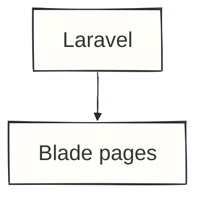

# slidev-theme-boulit

A warm-paper, high-contrast Slidev theme for story-driven technical conference talks. Charcoal typography, vivid-orange accents, subtle square grids, optional hand-drawn doodles, quiet cards, and a fine editorial rule keep the focus on the story.

The theme is intentionally light-only, including code blocks and diagrams. Layouts target Slidev's default 16:9 canvas and scale with the presentation.

The top rule shows presentation progress: its orange fill is the slide number divided by the total number of slides, reaching 100% on the final slide. It updates automatically when navigating forward or backward, independently of click reveals, and uses each slide's own number in previews and exports.

## Use locally

Add the theme package to a Slidev project:

```json
{
  "devDependencies": {
    "slidev-theme-boulit": "file:../path/to/slidev-theme-boulit"
  }
}
```

Then select it in `slides.md`:

```md
---
theme: boulit
---
```

## Publish and reuse

The package follows Slidev's `slidev-theme-*` naming and metadata conventions. After publishing it to npm, install it with:

```bash
npm install --save-dev slidev-theme-boulit
```

## Layouts

- `cover` — wide, left-aligned title with an optional `.cover-mark`
- `section` — centered chapter divider on a soft accent wash
- `statement` — large, centered takeaway with a quiet accent gradient
- `fact` — oversized metric
- `quote` — conference-style quotation

Slidev's built-in layouts such as `default`, `center`, `two-cols`, `image-left`, and `image-right` remain available.

The `two-cols` layout vertically aligns both columns and places the right-hand content on a bordered panel. Set `layoutClass: gap-12` in the slide frontmatter to separate the columns. Cover slides also accept a `background` image with a palette-aware overlay for legibility.

Wrap content in `<BoulitPaper>` for crumpled, ruled off-white paper, a folded corner, a slight tilt, and textured black tape. Each instance generates independent crease counts, positions, angles, lengths, and widths rather than perturbing a shared fold pattern. Scratches, fine wrinkles, and lighting also vary behind the content without distorting text or diagrams. Text uses the bundled Patrick Hand font. The component works in any layout, and multiple notes can share a slide. In the right column of `two-cols`, it replaces the standard panel styling automatically.

```md
<BoulitPaper>

## Remember

Document the behavior before rewriting it.

</BoulitPaper>
```

Patterns remain stable while a component is mounted, including during click reveals. A fresh mount or page reload generates a new pattern. To preserve a particular pattern across reloads and exports, use a fixed numeric seed, for example `<BoulitPaper :seed="42">...</BoulitPaper>`. Identical seeds produce identical textures; use different seeds for different notes.

Mermaid diagrams have their own font settings. For a handwritten diagram on the paper, add configuration inside its Mermaid fence:

````md
<BoulitPaper>



</BoulitPaper>
````

The fixed seed keeps the sketch consistent between renders. The font is served locally and loaded before Mermaid measures its labels, so the lettering does not depend on installed fonts or a font CDN.

## Components

Reusable implementations live in `components/`, including `BoulitPaper.vue`, `BoulitDoodles.vue`, `BoulitGrid.vue`, and `BoulitProgress.vue`. The root `slide-top.vue` is only the Slidev-required entry point that selects the background and renders progress automatically on each slide; do not add duplicate instances to slide content.

```md
<BoulitBadge>TypeScript</BoulitBadge>
<BoulitBadge tone="neutral">In progress</BoulitBadge>
<BoulitBadge tone="danger">Risk</BoulitBadge>

<BoulitMetric value="1.5" label="years" />

<BoulitCallout>
  Put the sentence the audience should remember here.
</BoulitCallout>

<BoulitCallout tone="danger">
  Make the risk explicit.
</BoulitCallout>
```

The `.metric-row` and `.takeaway` utilities share the same styling as their component counterparts. Existing talk utilities, including `.pressure-grid`, `.foundation-flow`, `.track`, and `.lesson-grid`, remain available.

## Theme tokens

Override the palette in a presentation-level `style.css`:

```css
:root {
  --boulit-accent: #f45100;
  --boulit-accent-strong: #bd3c00;
  --boulit-accent-soft: #fff0e5;
  --boulit-amber: #ad640c;
  --boulit-danger: #b33443;
  --boulit-danger-soft: #faecee;
  --boulit-surface: #f8f7f4;
  --boulit-panel: #fdfcfb;
  --boulit-panel-strong: #ffffff;
  --boulit-ink: #242b30;
  --boulit-line: #deddd7;
  --boulit-grid-line: #f0efeb;
  --boulit-doodle-opacity: 0.5;
  --boulit-muted: #626761;
  --boulit-radius: 0.85rem;
}
```

Typography and elevation can also be customized with `--boulit-font-sans`, `--boulit-font-mono`, and `--boulit-shadow`. The existing `--andreas-*` aliases are retained for compatibility. When changing the palette, keep text colors readable against both the surface and soft accent colors.

Slides use a subtle 2.5rem square grid by default. Set `--boulit-grid-line: transparent` to hide it. To replace the grid with doodles on an individual slide, opt in through that slide's frontmatter:

```yaml
---
layout: cover
doodles: true
---
```

For a plain background without decorative patterns, use `backgroundPattern: none` in a slide's frontmatter. This explicit setting takes precedence over `doodles: true` and leaves the progress bar visible.

The main talk uses a plain background on its opening slide, doodles on the introduction and thank-you slides, and the square grid on all technical and lessons slides. All backgrounds remain behind the content, including taped-paper diagrams.

When enabled, decorative arrows, stars, squiggles, coding symbols, ice cream cones, pizza slices, lollipops, unicorns, rainbows, ducks, music notes, photography cameras, film strips, rolls of film, Minnie Mouse and Stitch heads, rocking horses, and a cowboy-hatted tractor driver cover the whole canvas with randomized, staggered placement. The default 16:9 canvas displays 60 doodles, with density adapting to other canvas sizes. Their seeded composition stays consistent across navigation, previews, and exports. Pale neutral and peach strokes sit above the slide background but below the content; text, cards, and diagrams remain on top. Doodles ignore pointer events and are hidden from assistive technology. Set `--boulit-doodle-opacity: 0` to hide them, or lower the default `0.5` to soften them further.

The orange palette separates emphasis from readable small text:

- `--boulit-accent` is the vivid orange for large headings, metrics, diagram borders, and progress. It provides at least 3:1 contrast against the default light surfaces and the peach progress track.
- `--boulit-accent-strong` is the text orange for links, badges, eyebrows, and small numbers. It provides at least 4.5:1 contrast against the default light surfaces.
- `.accent` uses the text-safe shade by default, switching to vivid orange in `h1`, `h2`, and the theme's large statement, timeline, and closing utilities.

Keep vivid-orange text at least 24px regular or approximately 19px bold. Use the stronger shade for smaller text; these contrast guarantees apply to the default palette, not arbitrary background images or custom colors.

Mermaid uses a matching palette in `setup/mermaid.ts`. To customize diagram colors in a consuming presentation, use Slidev's `setup/mermaid.ts` hook; CSS tokens do not configure Mermaid's generated SVG theme. Explicit Mermaid node styles are preserved.

## Development

From the theme directory, run the example deck against the local package:

```bash
npx slidev example.md
```

From this repository's root, `npm run theme:dev` opens the component and layout showcase. `npm run dev` opens the full talk.

## License

MIT

The bundled Patrick Hand font is by Patrick Wagesreiter and distributed under the SIL Open Font License 1.1; see `styles/fonts/OFL-PatrickHand.txt`.
