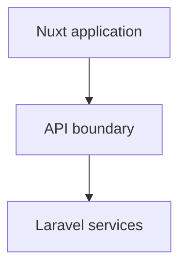

<div class="eyebrow">Conference title</div>

# A focused theme for<br><span class="accent">technical stories</span>

### Strong hierarchy, restrained color, and room to speak.

<div class="speaker-line">Andreas Panopoulos · Staff Engineer</div>
<div class="cover-mark">01</div>

---
layout: section
---

# One chapter.<br><span class="accent">One idea.</span>

---

# Reusable components

<div class="flex gap-3 mb-12">
  <BoulitBadge>Vue</BoulitBadge>
  <BoulitBadge>TypeScript</BoulitBadge>
  <BoulitBadge tone="neutral">In progress</BoulitBadge>
  <BoulitBadge tone="danger">Risk</BoulitBadge>
</div>

<div class="flex gap-8">
  <BoulitMetric value="2" label="frontend engineers" />
  <BoulitMetric value="1.5" label="years" />
</div>

<BoulitCallout class="mt-12">
  Put the sentence the audience should remember here.
</BoulitCallout>

---
layout: statement
---

# Your team's memory<br>is not <span class="accent">documentation.</span>

---
layout: fact
---

# 42%

The metric gets the stage.

---
layout: quote
---

# Simplicity is prerequisite for reliability.

Edsger W. Dijkstra

---
layout: two-cols
layoutClass: gap-12
---

<div class="eyebrow">Architecture</div>

# Give the story<br>a clear direction.

## Keep the explanation close to the system it describes.

::right::



---
layout: two-cols
layoutClass: gap-10
---

# Built for the details

Use `computed()` for derived state. Let syntax highlighting carry the structure.

```ts
const completed = computed(() =>
  tasks.value.filter(task => task.done),
)
```

::right::

| Layer | Responsibility |
| --- | --- |
| Pages | User journeys |
| Components | Shared UI |
| Composables | Reusable logic |

---
layout: center
---

# Clear signals, not more noise

<div class="lesson-grid mt-8">
  <div><strong>01</strong><span>Document the current behavior</span></div>
  <div><strong>02</strong><span>Make the boundaries explicit</span></div>
</div>

<BoulitCallout class="mt-8">
  Keep the next decision visible.
</BoulitCallout>

<BoulitCallout tone="danger" class="mt-4">
  Communicate risk before it becomes a missed deadline.
</BoulitCallout>

---
layout: center
---

# Notes worth keeping

<div class="flex gap-10 mt-12">
  <BoulitPaper>
    <h2>Understand first.</h2>
    <p>Document how the current product behaves before you rewrite it.</p>
  </BoulitPaper>
  <BoulitPaper>
    <h2>Share the risk.</h2>
    <p>Keep scope, priorities, and expectations in the conversation.</p>
  </BoulitPaper>
</div>
